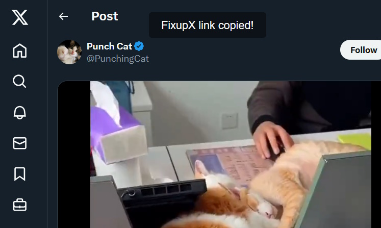
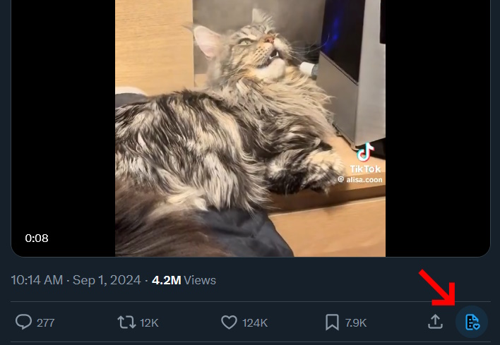

# X/Twitter - Copy FixupX Link

CFL is a simple userscript that allows the copy of a [FixupX](https://github.com/FixTweet/FxTwitter) link to a tweet, either via keyboard shortcut or a button in the tweet. FixupX provides an improved sharing experience for tweets that contain pictures or videos in some social media platforms.

## Features

- **Copy to Clipboard :** The copied URL will be placed right in your clipboard, just paste it anywhere you want.

- **Simple Notification:** Copying a FixupX link will trigger a popup to let you know you've been successful.

## Installation

1. Install a userscript manager (like [Violentmonkey](https://violentmonkey.github.io/get-it/)).
2. [Click here to install](https://github.com/WesternFreak/XTwitter-Copy-FixupX-Link/raw/main/yt-cfl.user.js) the script.

## How to Use

- `Ctrl` + `Left Alt` + `F`, if in a tweet's page
  
  _OR_
- Click the button in the lower-right corner of the tweet

